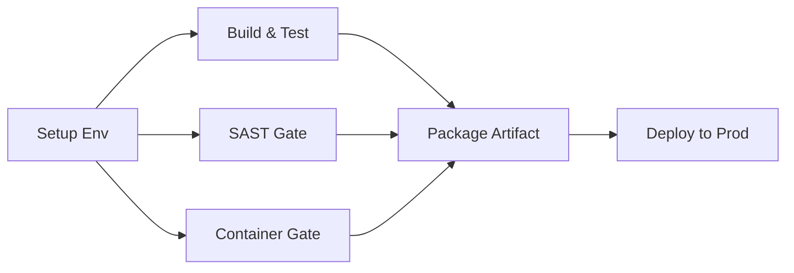

# Track: Node.js Service Golden Path (v1.0)

> **File:** `build-node-container-v1.yaml`
> **Type:** Reusable Workflow (`workflow_call`)
> **Maintainer:** Platform Engineering Team

## Overview
This is the **Standard Delivery Track** for all Node.js backend services. It encapsulates the entire software delivery lifecycle into a single, governed pipeline.

By consuming this track, Application Teams receive a **Level 3 UAD Supply Chain** out of the box, including:
1.  **Hermetic Builds:** Builds run in immutable, hash-pinned Docker containers (e.g., `node@sha256:...`).
2.  **Parallel Security Gates:** SAST (Semgrep) and SCA (Trivy) run automatically using governed policy versions.
3.  **Artifact Provenance:** Docker images are built only *after* security checks pass.
4.  **Zero-Config Deployment:** Automatic deployment to the production runtime (simulated via Self-Hosted Runner).

---

## Workflow Architecture

The pipeline executes the following hermetic stages:



1.  **Setup Environment:** Resolves "Node 20" to a specific immutable Docker SHA.
2.  **Build & Verify:** Runs `npm ci` and `npm test` inside that exact container.
3.  **Security Gates:** Downloads Policy Assets (v1.0/v2.0) and scans source code + dependencies.
4.  **Package Artifact:** Builds the Docker image and saves it as a tarball (Artifact).
5.  **Deploy to Prod:** Downloads the artifact to the production runner and applies infrastructure via Terraform.

---

## Usage

To use this track, create a workflow in your Asset repository (e.g., `.github/workflows/ci.yaml`) and invoke this file.

### Inputs

| Input | Type | Required | Description |
| :--- | :--- | :--- | :--- |
| `node-version` | `string` | **Yes** | The Node.js version to use. Supported: `"18"`, `"20"`. (Maps to pinned SHAs). |
| `sast-policy-version` | `string` | **Yes** | The SAST Governance Asset version to enforce (e.g., `"v1.0"`). |
| `container-scan-policy-version` | `string` | **Yes** | The Container Security Governance Asset version to enforce (e.g., `"v1.0"`). |
| `working-directory` | `string` | No | Path to the directory containing `package.json` (default: `"."`). |

### Example Consumer Config

```yaml
name: CI

on:
  push:
    branches: [ "main" ]

jobs:
  delivery:
    # 🔒 Reference the immutable track version
    uses: [Owner]/uad-reference-implementation/_supply_chain/pipelines/tracks/build-node-container-v1.yaml@v1
    
    with:
      node-version: "20"
      sast-policy-version: "v1.0"
      container-scan-policy-version: "v1.0"
      working-directory: "./src"

## UAD Compliance Notes

* **Immutability:** This pipeline does not run `npm install`. It runs `npm ci`. If your `package-lock.json` is missing, the build will fail by design.
* **Isolation:** The build environment is ephemeral. No files persist between jobs unless explicitly passed as Artifacts.
* **Gating:** It is impossible to deploy to production if the `security-check` job fails. The `push-to-registry` job has a strict dependency on the success of the gates.